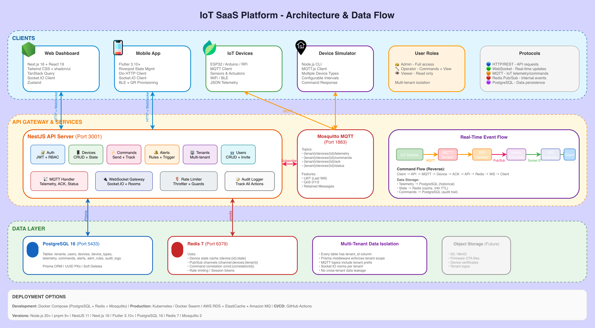

<h1 align="center">🔌 ThingBase</h1>

<p align="center">
  <strong>Open-source IoT platform for developers. Device management, real-time telemetry, and multi-tenant control.</strong>
</p>

<p align="center">
  <a href="#features">Features</a> •
  <a href="#architecture">Architecture</a> •
  <a href="#tech-stack">Tech Stack</a> •
  <a href="#quick-start">Quick Start</a> •
  <a href="#project-structure">Structure</a> •
  <a href="#api-reference">API</a> •
  <a href="#mobile-app">Mobile</a>
</p>

<p align="center">
  
  
  
  
</p>

<p align="center">
  
</p>

## ✨ Features

### 🏢 Multi-Tenancy
- **Complete tenant isolation** - Each organization has its own devices, users, and data
- **White-label support** - Customizable branding per tenant
- **Role-based access control** - Admin, Operator, Viewer roles

### 📱 Cross-Platform Clients
- **Web Dashboard** - Next.js 16 with modern React patterns
- **Mobile App** - Flutter for iOS & Android
- **Real-time updates** - Socket.IO for live telemetry

### 🔧 Device Management
- **Device provisioning** - QR code, BLE, and SoftAP support
- **Device types** - Configurable schemas for different IoT devices
- **Commands** - Send commands with acknowledgment tracking
- **State shadow** - Redis-cached device state for instant access

### 📊 Real-Time Telemetry
- **MQTT broker** - Eclipse Mosquitto for device communication
- **Live updates** - WebSocket streaming to web and mobile
- **Historical data** - PostgreSQL with TimescaleDB-ready schema
- **Charts & visualization** - Recharts for telemetry graphs

### 🔔 Alerts & Monitoring
- **Threshold alerts** - Trigger on sensor value conditions
- **Device offline alerts** - Automatic detection via MQTT LWT
- **Alert history** - Track and acknowledge alerts

### 🔐 Security
- **JWT authentication** - Access & refresh tokens
- **Rate limiting** - Per-endpoint throttling
- **Tenant isolation** - Database-level separation
- **Audit logging** - Track all user actions

---

## 🏗️ Architecture

> 📐 **[View Full Architecture Diagram](docs/architecture.drawio)** - Open in [draw.io](https://app.diagrams.net/) for detailed view with all components, protocols, and data flows.

### High-Level Overview

```
┌─────────────────────────────────────────────────────────────────────────────┐
│                              CLIENTS                                         │
├─────────────────────────────────────────────────────────────────────────────┤
│                                                                              │
│    ┌──────────────┐     ┌──────────────┐     ┌──────────────┐              │
│    │   Next.js    │     │   Flutter    │     │  IoT Device  │              │
│    │  Web Client  │     │  Mobile App  │     │  (ESP32, etc)│              │
│    └──────┬───────┘     └──────┬───────┘     └──────┬───────┘              │
│           │                    │                    │                        │
│           │ HTTP/WS            │ HTTP/WS            │ MQTT                   │
│           ▼                    ▼                    ▼                        │
├─────────────────────────────────────────────────────────────────────────────┤
│                              BACKEND                                         │
├─────────────────────────────────────────────────────────────────────────────┤
│                                                                              │
│    ┌─────────────────────────────────────────────────────────────────┐     │
│    │                         NestJS API                               │     │
│    │  ┌─────────┐ ┌─────────┐ ┌─────────┐ ┌─────────┐ ┌─────────┐   │     │
│    │  │  Auth   │ │ Devices │ │ Commands│ │  MQTT   │ │ WebSocket│   │     │
│    │  │ Module  │ │ Module  │ │ Module  │ │ Handler │ │ Gateway  │   │     │
│    │  └─────────┘ └─────────┘ └─────────┘ └─────────┘ └─────────┘   │     │
│    └─────────────────────────────────────────────────────────────────┘     │
│                         │           │           │                           │
│                         ▼           ▼           ▼                           │
│    ┌──────────────┐ ┌──────────────┐ ┌──────────────┐                      │
│    │  PostgreSQL  │ │    Redis     │ │  Mosquitto   │                      │
│    │    (Data)    │ │ (Cache+PubSub)│ │(MQTT Broker) │                      │
│    └──────────────┘ └──────────────┘ └──────────────┘                      │
│                                                                              │
└─────────────────────────────────────────────────────────────────────────────┘
```

### Real-Time Data Flow

```
Device → MQTT → API → Redis Pub/Sub → WebSocket Gateway → Web/Mobile Clients
                 ↓
            PostgreSQL (historical storage)
```

---

## 🛠️ Tech Stack

### Backend (`apps/api`)
| Technology | Purpose |
|------------|---------|
| **NestJS 11** | Node.js framework with TypeScript |
| **Prisma 6** | Type-safe ORM |
| **PostgreSQL 16** | Primary database |
| **Redis 7** | Caching, pub/sub, session storage |
| **Mosquitto 2** | MQTT broker for IoT devices |
| **Socket.IO 4** | Real-time WebSocket communication |
| **JWT** | Authentication tokens |
| **Zod** | Runtime validation |

### Web Frontend (`apps/web`)
| Technology | Purpose |
|------------|---------|
| **Next.js 16** | React framework (App Router, Turbopack) |
| **React 19** | UI library |
| **Tailwind CSS 4** | Utility-first styling |
| **shadcn/ui** | Accessible UI components |
| **TanStack Query** | Server state management |
| **Zustand** | Client state management |
| **Recharts** | Data visualization |
| **React Hook Form + Zod** | Forms and validation |

### Mobile App (`apps/mobile`)
| Technology | Purpose |
|------------|---------|
| **Flutter 3.10+** | Cross-platform framework |
| **Riverpod** | State management |
| **Dio** | HTTP client |
| **Socket.IO Client** | Real-time updates |
| **Flutter Blue Plus** | BLE device provisioning |
| **Mobile Scanner** | QR code scanning |

### Device Simulator (`apps/simulator`)
| Technology | Purpose |
|------------|---------|
| **Node.js** | Runtime |
| **MQTT.js** | MQTT client |
| **Commander** | CLI interface |

### Infrastructure
| Technology | Purpose |
|------------|---------|
| **Docker Compose** | Local development environment |
| **Turborepo** | Monorepo build system |
| **pnpm 9** | Fast, disk-efficient package manager |

---

## 🚀 Quick Start

### Prerequisites

- **Node.js** 20+
- **pnpm** 9+ (`npm install -g pnpm`)
- **Docker** & Docker Compose
- **Flutter** 3.10+ (for mobile development)

### 1. Clone & Install

```bash
git clone <repository-url>
cd iot-saas
pnpm install
```

### 2. Start Infrastructure

```bash
docker compose up -d
```

This starts:
- PostgreSQL on port `5433`
- Redis on port `6379`
- Mosquitto MQTT on port `1883`

### 3. Configure Environment

```bash
cp apps/api/.env.example apps/api/.env
```

Default `.env` values work out of the box for local development.

### 4. Initialize Database

```bash
pnpm --filter @repo/api db:push
```

### 5. Start Development Servers

```bash
# Terminal 1 - API Server
pnpm --filter @repo/api dev

# Terminal 2 - Web Client
pnpm --filter @repo/web dev

# Terminal 3 (optional) - Device Simulator
pnpm --filter @repo/simulator build
pnpm --filter @repo/simulator start --tenant-id <id> --device-id <id>
```

### 6. Access Applications

| Application | URL |
|-------------|-----|
| Web Dashboard | http://localhost:3000 |
| API Server | http://localhost:3001 |
| API Docs (Swagger) | http://localhost:3001/api/docs |

### 7. First-Time Setup

1. Open http://localhost:3000/register
2. Create your organization (tenant) and admin account
3. Log in and start adding devices!

---

## 📁 Project Structure

```
iot-saas/
├── apps/
│   ├── api/                    # NestJS Backend
│   │   ├── src/
│   │   │   ├── modules/
│   │   │   │   ├── auth/       # JWT authentication
│   │   │   │   ├── tenants/    # Multi-tenant management
│   │   │   │   ├── users/      # User CRUD & invitations
│   │   │   │   ├── devices/    # Device management
│   │   │   │   ├── device-types/ # Device type schemas
│   │   │   │   ├── commands/   # Command lifecycle
│   │   │   │   ├── alerts/     # Alert rules & triggers
│   │   │   │   ├── mqtt/       # MQTT handlers
│   │   │   │   ├── websocket/  # Socket.IO gateway
│   │   │   │   └── health/     # Health checks
│   │   │   ├── common/         # Guards, decorators, pipes
│   │   │   ├── prisma/         # Database service
│   │   │   └── redis/          # Redis service
│   │   └── prisma/
│   │       └── schema.prisma   # Database schema
│   │
│   ├── web/                    # Next.js Frontend
│   │   └── src/
│   │       ├── app/            # App Router pages
│   │       ├── components/     # React components
│   │       │   ├── ui/         # shadcn/ui primitives
│   │       │   └── app/        # Application components
│   │       ├── hooks/          # Custom React hooks
│   │       ├── lib/            # Utilities, API client
│   │       └── stores/         # Zustand stores
│   │
│   ├── mobile/                 # Flutter Mobile App
│   │   └── lib/
│   │       ├── core/           # Config, network, storage
│   │       ├── features/       # Feature modules
│   │       │   ├── auth/       # Authentication
│   │       │   ├── devices/    # Device management
│   │       │   ├── dashboard/  # Home dashboard
│   │       │   ├── alerts/     # Alerts view
│   │       │   └── settings/   # App settings
│   │       └── router/         # GoRouter navigation
│   │
│   └── simulator/              # Device Simulator CLI
│       └── src/
│           ├── cli.ts          # CLI entry point
│           └── simulator.ts    # Device simulation logic
│
├── firmware/
│   └── esp32/                  # ESP32 Sample Firmware (C++/Arduino)
│
├── packages/
│   └── shared/                 # Shared TypeScript code
│       └── src/
│           ├── schemas/        # Zod validation schemas
│           ├── constants.ts    # Shared constants
│           └── types.ts        # TypeScript types
│
├── docs/                       # Documentation
├── infra/                      # Infrastructure configs
│   └── mosquitto/              # MQTT broker config
├── docker-compose.yml          # Development services
├── turbo.json                  # Turborepo config
└── pnpm-workspace.yaml         # Workspace definition
```

---

## 📚 API Reference

All API endpoints are prefixed with `/api/v1` and require JWT authentication unless noted.

### Authentication
| Method | Endpoint | Description | Auth |
|--------|----------|-------------|------|
| POST | `/auth/register` | Register tenant + admin | ❌ |
| POST | `/auth/login` | Login | ❌ |
| POST | `/auth/refresh` | Refresh access token | ❌ |
| POST | `/auth/logout` | Logout | ✅ |
| POST | `/auth/me` | Get current user | ✅ |

### Devices
| Method | Endpoint | Description | Role |
|--------|----------|-------------|------|
| GET | `/devices` | List devices | Any |
| GET | `/devices/:id` | Get device | Any |
| GET | `/devices/:id/state` | Get device state | Any |
| POST | `/devices` | Create device | Admin |
| PATCH | `/devices/:id` | Update device | Admin |
| DELETE | `/devices/:id` | Delete device | Admin |

### Commands
| Method | Endpoint | Description | Role |
|--------|----------|-------------|------|
| GET | `/commands` | List commands | Any |
| POST | `/commands` | Send command | Operator+ |
| POST | `/commands/:id/retry` | Retry command | Operator+ |

### Alerts
| Method | Endpoint | Description | Role |
|--------|----------|-------------|------|
| GET | `/alerts` | List alerts | Any |
| GET | `/alert-rules` | List alert rules | Any |
| POST | `/alert-rules` | Create alert rule | Admin |
| PATCH | `/alerts/:id/acknowledge` | Acknowledge alert | Operator+ |

### Users
| Method | Endpoint | Description | Role |
|--------|----------|-------------|------|
| GET | `/users` | List users | Admin |
| POST | `/users/invite` | Invite user | Admin |
| PATCH | `/users/:id` | Update user | Admin |
| DELETE | `/users/:id` | Delete user | Admin |

---

## 📱 Mobile App

The Flutter mobile app provides:

- **Device Dashboard** - Overview of all devices with status
- **Real-Time Telemetry** - Live sensor data via Socket.IO
- **Device Control** - Send commands to devices
- **QR Provisioning** - Scan QR to add devices
- **Push Notifications** - Alert notifications (coming soon)

### Running the Mobile App

```bash
cd apps/mobile

# Install dependencies
flutter pub get

# Run on iOS Simulator
flutter run -d ios

# Run on Android Emulator
flutter run -d android

# Run on physical device
flutter run -d <device-id>
```

### Configuration

Edit `apps/mobile/lib/core/config/app_config.dart` to set your API URL:

```dart
static const _dev = AppConfig(
  apiBaseUrl: 'http://localhost:3001/api/v1',
  wsBaseUrl: 'http://localhost:3001',
  environment: 'development',
);
```

For physical devices, use your machine's IP or a tunnel (e.g., ngrok).

---

## 🎮 Device Simulator

Test your platform without real hardware using the device simulator:

```bash
# Build the simulator
pnpm --filter @repo/simulator build

# Run with options
pnpm --filter @repo/simulator start \
  --tenant-id <your-tenant-id> \
  --device-id <your-device-id> \
  --type thermostat \
  --interval 3000
```

### Supported Device Types
- `thermostat` - Temperature, humidity, power, mode
- `switch` - Power, energy, current, voltage
- `water-pump` - Flow rate, pressure, motor temp
- `egg-incubator` - Temperature, humidity, rotation, heater
- `soil-sensor` - Moisture, pH, nitrogen, temperature
- `generic` - Basic telemetry

---

## 🧪 Development Commands

### Database
```bash
pnpm --filter @repo/api db:generate  # Generate Prisma client
pnpm --filter @repo/api db:push      # Push schema to database
pnpm --filter @repo/api db:migrate   # Create migration
pnpm --filter @repo/api db:studio    # Open Prisma Studio
```

### Build
```bash
pnpm build                           # Build all packages
pnpm --filter @repo/api build        # Build API only
pnpm --filter @repo/web build        # Build web only
```

### Linting
```bash
pnpm lint                            # Lint all packages
pnpm format                          # Format code with Prettier
```

---

## 🗺️ Roadmap

### ✅ Phase 1: Foundation
- [x] Monorepo setup with Turborepo
- [x] Shared schemas with Zod
- [x] Docker Compose infrastructure
- [x] NestJS API with Prisma

### ✅ Phase 2: Auth & Multi-Tenancy
- [x] JWT authentication
- [x] Tenant registration & management
- [x] RBAC guards
- [x] User management & invitations

### ✅ Phase 3: Device Management
- [x] Device CRUD APIs
- [x] Device provisioning
- [x] Device type schemas
- [x] Commands with acknowledgment

### ✅ Phase 4: Real-Time & MQTT
- [x] Mosquitto MQTT broker
- [x] MQTT handlers for telemetry
- [x] WebSocket gateway
- [x] Real-time web updates
- [x] Real-time mobile updates
- [x] Device simulator CLI

### ✅ Phase 5: Alerts & Monitoring
- [x] Threshold alert rules
- [x] Device offline detection
- [x] Alert acknowledgment
- [x] Audit logging

### 🔜 Phase 6: Production Readiness
- [ ] MQTT over TLS
- [ ] Email notifications
- [ ] Push notifications (mobile)
- [ ] File uploads (firmware OTA)
- [ ] API versioning
- [ ] Kubernetes deployment

---

## 🤝 Contributing

Contributions are welcome! Please read our contributing guidelines before submitting a PR.

1. Fork the repository
2. Create your feature branch (`git checkout -b feature/amazing-feature`)
3. Commit your changes (`git commit -m 'Add amazing feature'`)
4. Push to the branch (`git push origin feature/amazing-feature`)
5. Open a Pull Request

---

## 📄 License

This project is licensed under the MIT License - see the [LICENSE](LICENSE) file for details.

---

<p align="center">
  Made with ❤️ for the IoT community
</p>
